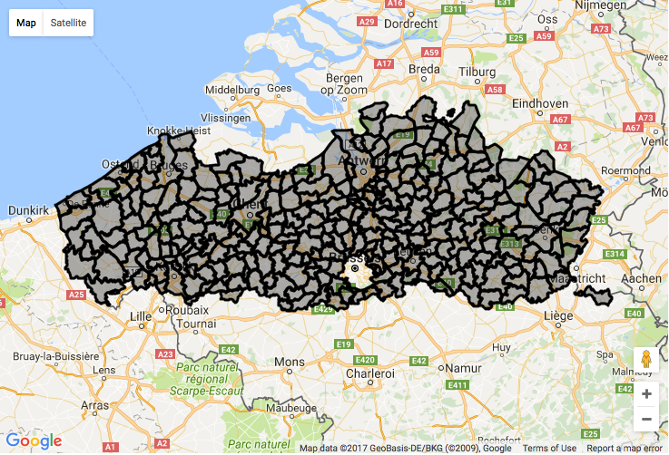

# Converting Geopunt GML to GeoJSON

## Prerequisites

* [Homebrew](http://brew.sh)
* [NPM (NodeJS)](https://docs.npmjs.com/getting-started/installing-node)

## Introduction

We'll be using the dataset "[Voorlopig referentiebestand gemeentegrenzen, toestand 29/01/2016](http://www.geopunt.be/catalogus/datasetfolder/670dc426-370a-4edc-ac65-6c4bcc065773)".

This dataset contains all municipalities and provinces in Flanders.
It DOES NOT contain municipalities from Brussels or Wallonia.

We'll convert the included municipalities as an example.

## Making sense of the data

Download the `GML` archive (18mb) and unzip it.

The municipalities are located in the `Refgem.gml` file. The shapes use `EPSG:31370` coordinates, and contain various metadata like the name of the municipality, it's surface area, etc.

## Converting the whole file to GeoJSON

We'll be using the `ogr2ogr` utility to convert the complete file to `GeoJSON`. This utility is included in the `GDAL` library.

* **GDAL**: http://www.gdal.org/index.html
* **ogr2ogr**: http://www.gdal.org/ogr2ogr.html

On macOS, the preferred method of installation is via Homebrew:

	brew -v install gdal
    
One of the dependencies of `gdal` is the `gcc` compiler, which will be built from source by Homebrew. This may take a while (depending on your system, **upwards of an hour**), which is why it's useful to run the install command in verbose mode (`-v`) to make sure the installation is not stuck when it is in fact compiling `gcc`.

Once completed, make sure that `ogr2ogr` is installed successfully:

	ogr2ogr --help
    
You should see a list of basic usage options, and advanced options.

Now we can convert the complete `GML` file to `GeoJSON` like this:

	ogr2ogr -f "GeoJSON" Refgem.json Refgem.gml
    
(This is not a typo, the correct order of the file is destination first and the source file second.)

The script will not print any output if no errors occurred. When finished, you should have a file `Refgem.json` in the same directory as the `Refgem.gml` file.

## Converting coordinates from EPSG:31370 to EPSG:4326

The `GeoJSON` standard requires all coordinates to be in the `EPSG:4326` format, while Geopunt data is in the Belgian `EPSG:31370` format.

We'll use the [npm reproject](https://github.com/perliedman/reproject) utility to do this conversion.

Install the utility globally:

	npm install -g reproject
    
To convert the coordinates, run:

	cat Refgem.json | reproject --use-spatialreference --from=EPSG:31370 --to=EPSG:4326 > Refgem4326.json
    
This will pipe the original `GeoJSON` file to the `reproject` utility, which will do the conversion and write the data to `Refgem4326.json`.

## Splitting into a file per municipality

The resulting file with all municipalities can be over 80mb, which is often too big to parse by most JSON editors and/or online map viewers.

To split the file into multiple smaller files, one for each municipality, we'll use the [npm geojsplit](https://www.npmjs.com/package/geojsplit) utility.

Install the utility globally:

	npm install -g geojsplit
    
Verify that the utility is installed successfully by running:

	geojsplit --help
    
You should see something like:

	Usage: geojsplit [-a suffix_length] [-l geometry_count] filename

	Version: 0.1.0
    
    ...
    
Before we split the files, we should create a subdirectory to store them in:

	mkdir -p geojson/gem
    
Now we can run `geojsplit` and tell it to write the resulting files to this directory:

	geojsplit -a 0 -v -k "NAAM" -o geojson/gem Refgem4326.json
    
`-k "NAAM"` tells `geojsplit` to use each municipalities' name for their respective filename.

You should now have 308 files, one for each municipality, in the `split/gem` directory:

	ls -l geojson/gem
    
	-rw-r--r--  1 bert  staff  195010 Feb 10 11:52 Aalst_x.geojson
    -rw-r--r--  1 bert  staff  151930 Feb 10 11:52 Aalter_x.geojson
    -rw-r--r--  1 bert  staff  167454 Feb 10 11:52 Aarschot_x.geojson
    -rw-r--r--  1 bert  staff  100494 Feb 10 11:52 Aartselaar_x.geojson
	...

## Removing the _x suffix

Unfortunately `geojsplit` adds a `_x` suffix to the filenames of our `.geojson` files, and this can not be disabled.

To remove this suffix, run the following command:

	for i in geojson/gem/*_x.geojson; do 
		mv -v ${i} ${i%_x.geojson}.geojson; 
	done;
    
You should now have a list of files like this:

	ls -l geojson/gem
    
	-rw-r--r--  1 bert  staff  195010 Feb 10 11:52 Aalst.geojson
    -rw-r--r--  1 bert  staff  151930 Feb 10 11:52 Aalter.geojson
    -rw-r--r--  1 bert  staff  167454 Feb 10 11:52 Aarschot.geojson
    -rw-r--r--  1 bert  staff  100494 Feb 10 11:52 Aartselaar.geojson
	...
	
## Slugifying the filenames

We want each filename to be the ID of the final document when indexed by ElasticSearch.

To slugify the filename and add a prefix, run the following command:

	cd geojson/gem;
	for file in *.geojson; do
  		if [ -f "$file" ]; then
	   		ext=${file##*.}
   			name=${file%.*}
	   		slug=$(echo "$name"| iconv -t ascii//TRANSLIT | sed -E s/[^a-zA-Z0-9]+/-/g | sed -E s/^-+\|-+$//g | tr A-Z a-z)
   			mv -v $file "gem-$slug.$ext"
	  	fi
	done
	cd ../../;
    
## Converting each file from a FeatureCollection to a single Feature

At this point we have a file per municipality, but each file still contains a `FeatureCollection` with `0..n` possible `Feature` objects. In reality however, each file only contains a single `Feature`, so we can remove the surrounding wrapper. This makes it easier to work with each file later on.

To manipulate the JSON in each file, we'll need the [jq](https://stedolan.github.io/jq/) utility which can be installed using Homebrew:

	brew install jq
    
Verify that the utility is installed by running:

	jq --help
    
Now run the following command to modify each individual `.geojson` file and remove the `FeatureCollection` wrapper:

	for file in geojson/gem/*.geojson; do 
		jq '.features[0]' $file | awk 'BEGIN{RS="";getline<"-";print>ARGV[1]}' $file; 
	done;

## Validation

To make sure each file is still in a valid format, we'll use the [npm geojson-validation](https://www.npmjs.com/package/geojson-validation) utility.

Install the utility globally:

	npm install -g geojson-validation
    
Validate all `.geojson` files in the `split/gem` directory using:

	find geojson/gem -name "*.geojson" -print0 | xargs -0 gjv
    
The command will stop as soon as an invalid file is detected. The identify the file, look for the `NAAM` key in the output of the error. If all files are valid, you will just see a list of messages like this:

	valid!
    valid!
    valid!
    ...
    
If any errors occur, you could validate the file with all municipalities to make sure it was valid before it was split up:

	gjv Refgem4326.json
    
## Visualization

We can now view each municipality separately, or combined, in various web applications to make sure the data is still a correct representation of the various municipalities.

The easiest way to visualize our data is by using Google's [Drag and Drop GeoJSON](https://developers.google.com/maps/documentation/javascript/examples/layer-data-dragndrop) map.

Simple open the `split/gem` directory in a file browser, select all `.geojson` files, and drag the to the map show on the page.

The page may become unresponsive for a short time while all files are being parsed, but afterwards all shapes should be shown on the map and you should be able to zoom in/out and drag the map around.

    